+++
date = '2024-06-20T00:00:00+09:00'
draft = false
title = 'AWS Summit 2024'
categories = ['idea']
tags = ['conference', 'memo']
+++

AWS Summit 2024の参加メモ。

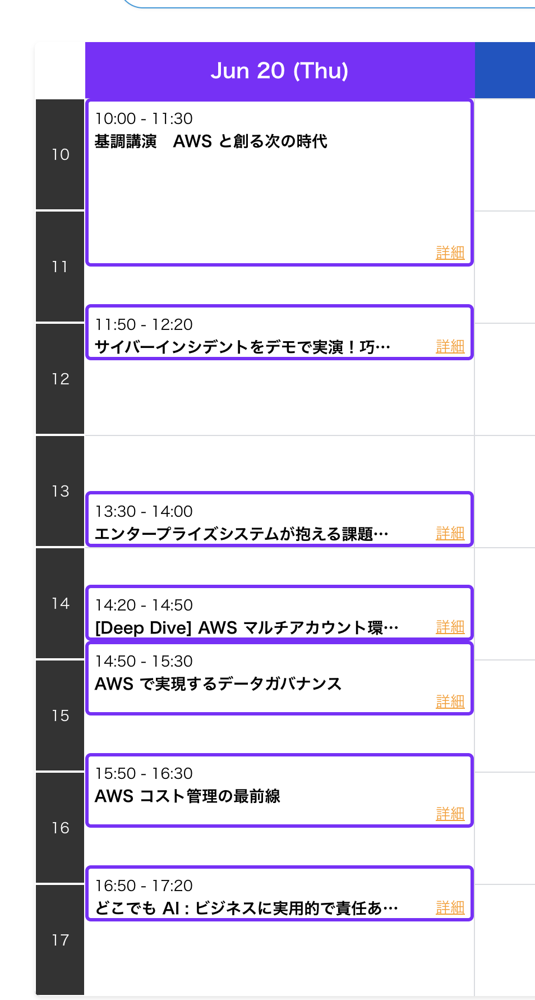

## 基調講演 - AWS と創る次の時代

### 導入

- Tech for good
- AI for good
  - AI についてはあまり話さない
  - 機能した AI は AI と気付けない →AI と呼ばなくなるだろう（AI の父ジョンマッカーシー
  - AI の歴史
    - 哲学者は自動化、機械を構築して人間の能力を向上させられるのではないか
      - 3000 年前から
      - プラトンも機械が人の大変な仕事をやることを想定
      - Basic：符号操作
      - アランチューリングのチューリングテスト
    - 1956 ダートマス大学
      - 哲学者が集まって AI について語った
      - 脳が司令して行動する（トップダウン）のがベーシック
      - エキスパートシステム
        - 少し複雑だっただけ
    - ボトムアップのトレンド
      - 感覚からエミュレーション
      - Amazon のセンターでロボットが走行
        - 自律走行
        - センサーで個別タスクの実行を可能に
        - rider, ペーダー？
    - transformers → LLMs
    - これまでもよく機能した AI もあったことを忘れてはいけない
  - AI for Now
    - 今何ができるか
  - AI for hard human problems
    - now for build
    - 2050 年の人口問題(97 億人)など
    - 日本：高齢者問題
      - テクノロジーで自宅にいられるかつ自立であるように、を目標
    - ジャカルタ：企業 HARA
    - Identity がない
      - → 銀行が融資してくれない
      - 闇金に行ってしまう
      - お金が結構なくなってしまう
  - AI for food
    - お米：世界の半数を占める食糧
    - IRRI：多様な品種の米を研究
      - 未処理の収穫物の貯蔵できる時間は短い
      - 遺伝子いじったりして研究
      - 種の仕分け → 画像認識
        - どれが長く生き延びたか確認
      - やったこと
      - 収穫量を最適化するシステムの構築
      - 面積を話す → 最適解
        - AI
    - ヤンマー
      - 作物の成長度を見る
      - → 必要なリソースを見る
    - What about protein?
      - 1kg の飼料 →1kg のタンパク質しか取れない
      - サーモンの養殖
      - コンピュータビジョンでの分析
      - 一匹毎に管理
        - 病気の検出（一匹かかると他にも影響あり
  - AI for Healthcare
    - スウェーデンの企業
      - 50 歳以上の女性でがんの早期検出
      - AI が画像を分析
      - 30%以上の危険を検知
      - ドローンでワクチンを届ける
      - 無人で完全自動化
      - 2018 年 12 月　赤ちゃんのジョイに届けた
    - ブラジル
      - 検体を持って帰る
      - 新生児の数％が持つ脳損傷の検知
      - 脳波キャプチャ
  - Data
    - AI for good(善) に必要
    - データは特権的 -事例：OpenStreetMap
      - ビジネス的に意味があるところしかマップを作らない
      - 何かあったときに赤十字とかがサポートできるように
    - 事例：Digital Earth Africa
      - アフリカ細かい衛星データを公開
      - → 違法な道路の検出
    - 昔は必要なデータを事前に構造化していた
    - 今は大量に保存できる
      - 金になり得るデータを見つけるのは難しい
      - → ML で発見しやすくする
    - 事例：THORN
      - 画像認識で児童虐待を防ぐ
      - SPOTLIGHT
        - 行方不明者の画像 DB→ 18,000 人の犠牲者を特定
      - safer(顧客プラットフォーム上で利用できる)
        - 児童性的虐待コンテンツの特定
        - アップロードされた画像に含まれているか
        - テキストベースでも検出可能
          - グルーミングの特定など
    - MSG
      - Good AI needs good data
      - Good data needs good AI
      - Good work needs good people
      - Now, go build

### 公演

#### Intro

- Amazon で大事にしていること
  - 長期的視野、お客様視点
  - 必要な時に必要なリソース＝お客様視点の一つ
  - サービスの品揃え数:240+
  - リージョン:33+7
  - AZ: 105+21
- AWS の取り組み
  - データセンターの信頼性
  - セキュリティ
  - コストパフォーマンス
    - 自社の最適化

##### 顧客

- NTT docomo
  - AWS で全国展開
- JPX
- 関西電力
- イオン Financial Group
  - 決済まわり
  - AWS で 16 のシステムを運用
- 盛岡市
  - デジタル庁の指導の元
  - ガバメントクラウド

#### クラウド＋生成 AI

Anthropic

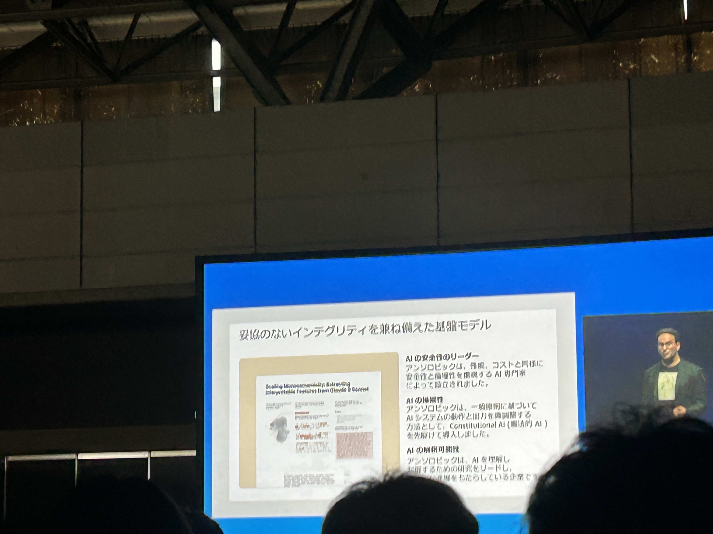

- 先進的なモデルを生み出す先進的な研究を行う
- Claude の開発
  - ケンポウ AI
    - AWS の利用で安全性を担保
- 社会的な研究
- ポリシー
  - 安全性に考慮し、自らの範囲を超えないように
- 他社の 1/5 の資本で最高水準のモデルをリリース
- わずか一年後に Claude3 もリリース
- エンタープライズ向けも開発
  - Opus：最も賢い
  - Haiku：高速でコンパクト
  - Sonnet：Opus と Haiku の中間

共同創設者権チーフサイエンティスト
ジャレッドカプラン

- AI の知能は予測的に向上させられる
  - HW、アルゴリズムで
- AI は通常と異なり、実験 → 成熟といったサイクルではない

##### 大きな問い

どのようにして責任を果たしながら生成 AI モデルの革新と拡大を続けるか？

### AWS と生成 AI

お知らせ：AWS で Claude3 が使える(Tokyo Region)

- AWS Trainium
  - トレーニングコストを最大 50%削減
- AWS Inferentia2
  - インフレンシア
- Amazon Bedrock
  - 最適な品質、コスト、レイテンシーを絵提供する
  - 幅広いモデルの選択肢

### ソニーでの生成 AI の取り組み

ソニーグループ COO 兼 CIO
小寺さん

方針：生成 AI を使い倒す

- カメラのオートフォーカス
- ゲームの AI エージェント
- ID や決済の不正検知

#### Enterprise LLM

社員が生成 AI のリスクと Opportunity を体感

### AWS の AI 支援

- Amazon Q（生成 AI アシスタント）
  - Tokyo Region での提供

後日

- モデル開発
- AI でプロダクトイノベーション

色々

- ITX パッケージ

### クラウドがもたらす影響

- ファストドクター
  - 緊急問診、オンライン問診サービス
  - Amazon Connect
  - 生成 AI
- atama+

### ispace

宇宙の探査関連の会社
日本が本社

- ペイロード
- データ
- パートナーシップ

## サイバーインシデントをデモで実演！ 巧妙化する脅威からあなたの組織を守るには？

- インスタンスメタデータ
  - 仮想マシンの持つ固有情報
  - 本来は管理目的で実装されている

### 攻撃デモ

- cmd.zip（ディレクトリトラバーサルを利用）で不正に apache の HTML の場所に配置
  - zip スリップ
- cmd.php ページにアクセス
  - 任意のコマンドを入力
  - リージョン情報の取得
  - アクセスキー、トークンの取得
  - ロール情報取得
- データ持ち出し
  - インスタンス情報の取得
  - secrets manager のアクセス失敗
  - s3 バケットにアクセス可能を確認
- マルウェア配置
  - ランサム Exe を混入
  - appspec も変更(ランサム Exe 実行されるように)
- CodeDeploy の仕様でデプロイされて感染

## エンタープライズシステムが抱える課題とマイクロサービスアーキテクチャ

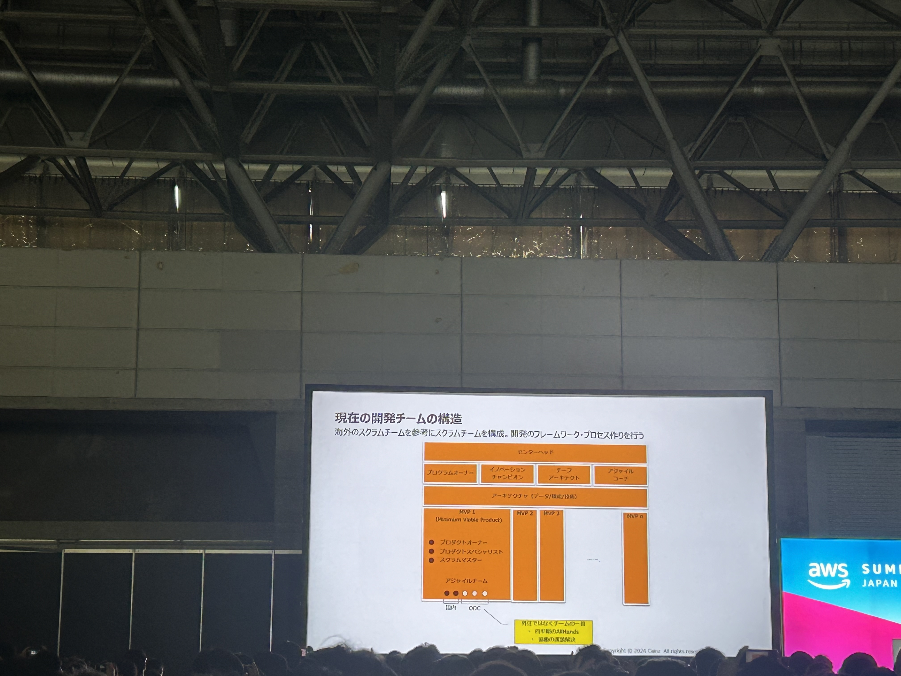

カインズ
ホームセンター運営

- Amazon との共通点
  - 低コスト、低価格、利便性
  - ビジネスモデルなど学ぶところが多い
    - Framework 参考など

ポイントカード会員 1200 万人

- 0.7%の人にマーケして売り上げ出すには、、、？？？

- 内製化の意味合い

  - オーナーシップを持つこと
  - ビジネス → システムの流れ

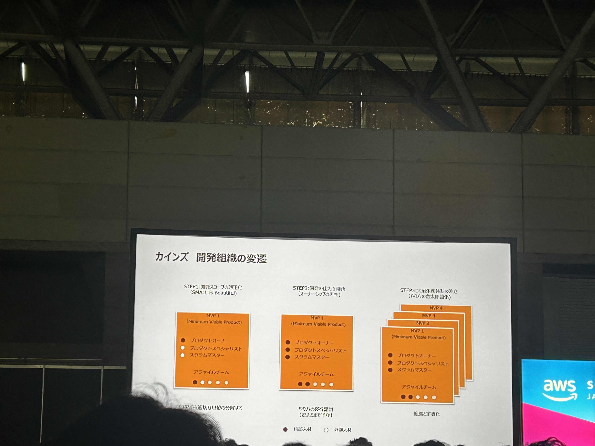

- 解決すべき課題

  - API の裏側の仕組みはベンダーに閉じている
    - =似たような機能がたくさんある
    - 発注システムが３つある
    - 普通の発注、グループ内の発注、出荷と入荷関連

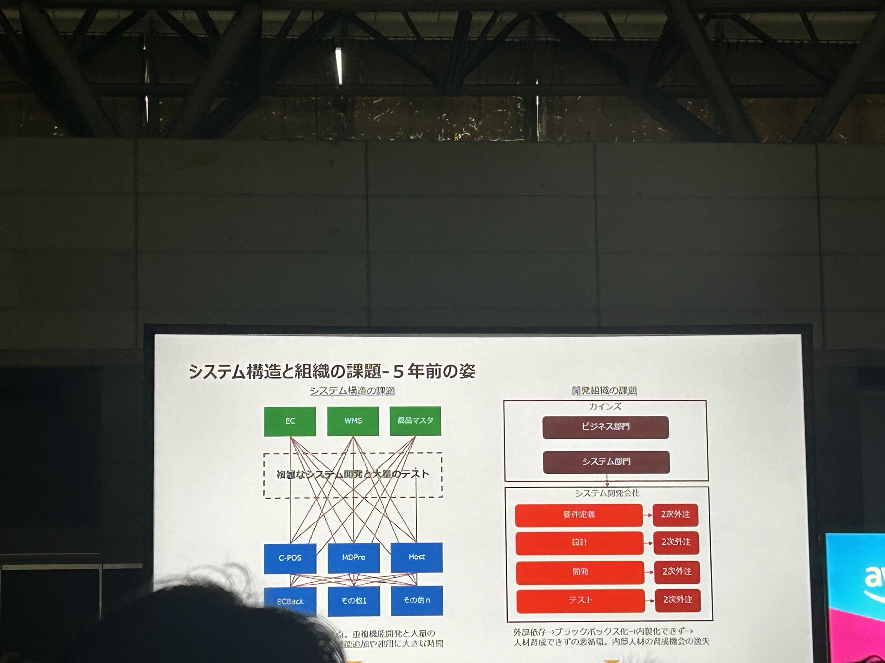

- オフラインとオンラインの融合

  - 店舗 → インターネット含む今
  - POS と EC、Mobile がやりとり、POS から売り上げ計上
  - POS、EC,Mobile→ コマースシステム → 売り上げ計上

- コンセプト

  - サービス同士を繋いで（オーケストレーション）最終的なアプリケーションを作る
  - サービス単位で再利用可能

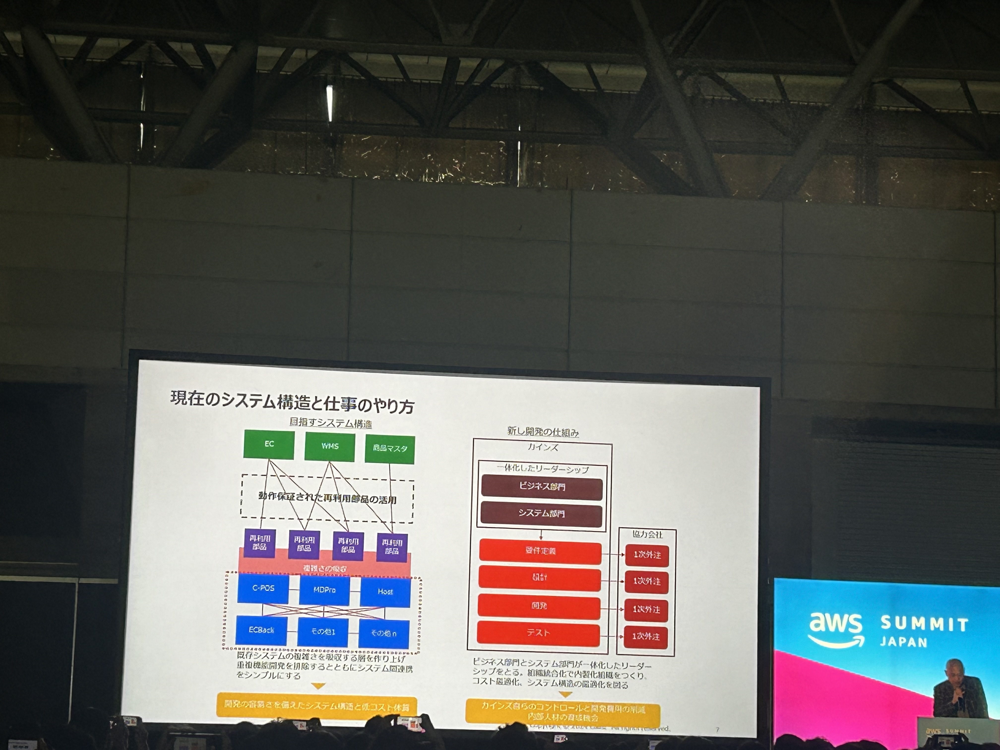

- リテールシステムの目指すもの＝コンポーサブルコマース（組み立て可能）
  - フロントエンド → フロントエンド用のコネクタ → オーケストレーション → バックエンド用のコネクタ → バックエンドサービス群

AWS への期待

- コンポーザブルコマースのバックエンドアーキテクチャ
  - サービスのプロビジョニング仕組み
  - マイクロサービスで分離されるサービスの影向管理
  - システムを支えるデータプレーンと BI のバーチャル統合

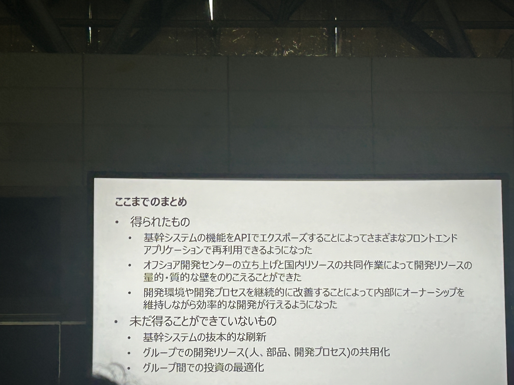

## AWSマルチアカウント

欠席

## AWSで実現するデータガバナンス

データ戦略の最優先事項

- データガバナンスとは
  - 企業内のデータを限られたアクセス範囲に閉じ込めて守ること（守り）
    ではなく、
  - ビジネス上のイノベーションを加速するためのツール（攻め）

### challenge

- More Data
  - データサイズ、種類が増えている
- More Sources
  - データが増えている
  - アクセスに時間がかかる
- More Business Units
  - ビジネスに関わる人が増えている

### AWS のデータガバナンスフレームワーク

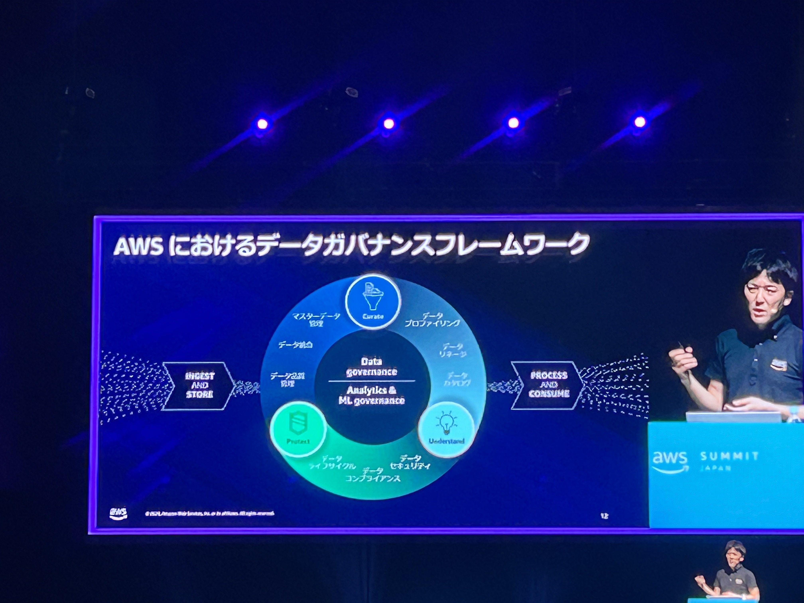

- ビジネスを起点、要件からアプローチ
- スモールスタート

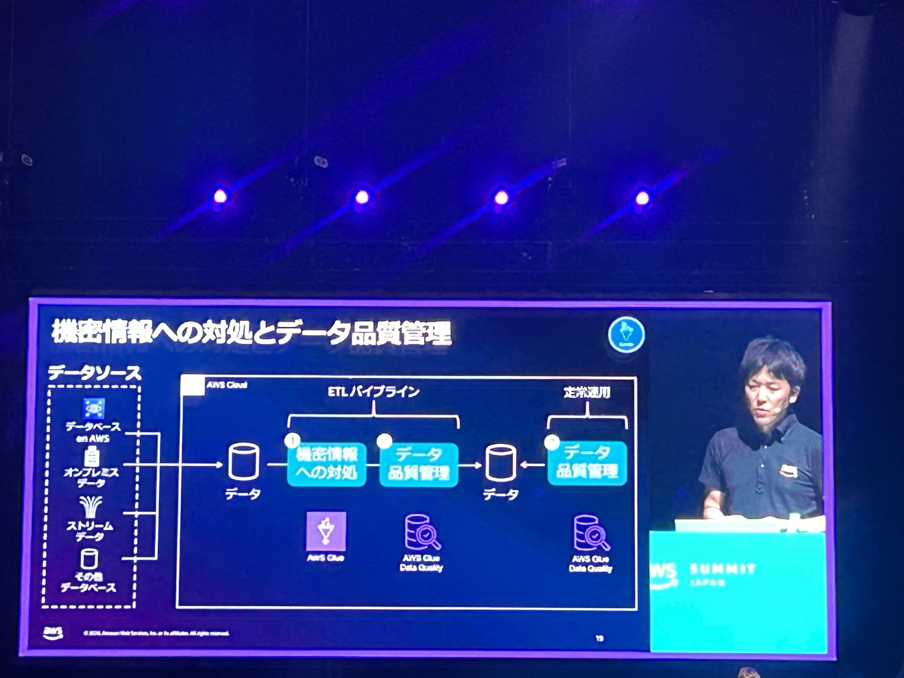

#### Point

1. Curate
   - データ品質、データを綺麗にする
   - AWS Glue
     - 機密データ検知：個人情報（PII）があるか
       - 自動削除、ダミーで置き換えるなどのマスキング
     - 機密データは国によって変わるが、対応済み
     - Glue Data Quality で品質ルール推薦、手動で適用も可能
     - ML でデータ品質ルールを段階的に強化
2. Understand
   - メタデータ管理
     - 要件
       - どこにあるかわからんので検索したい
       - 分析に活用できるか知りたい
       - 信頼できる品質のデータか知りたい
   - Amazon DataZone
     - 生成 AI で自動化
     - 社内データを管理するマーケットプレイスのようなもの
     - Glue のデータカタログを使って登録できる（リンクを貼るだけ）
   - ビジネスメタデータ
     - ビジネス的な意味、ラベル
     - テクニカルメタデータ
     - ビジネス用語集とデータフォーム
3. Protect
   - アクセスコントロール
   - アクセス許可、権限の設定で組織間も共有可

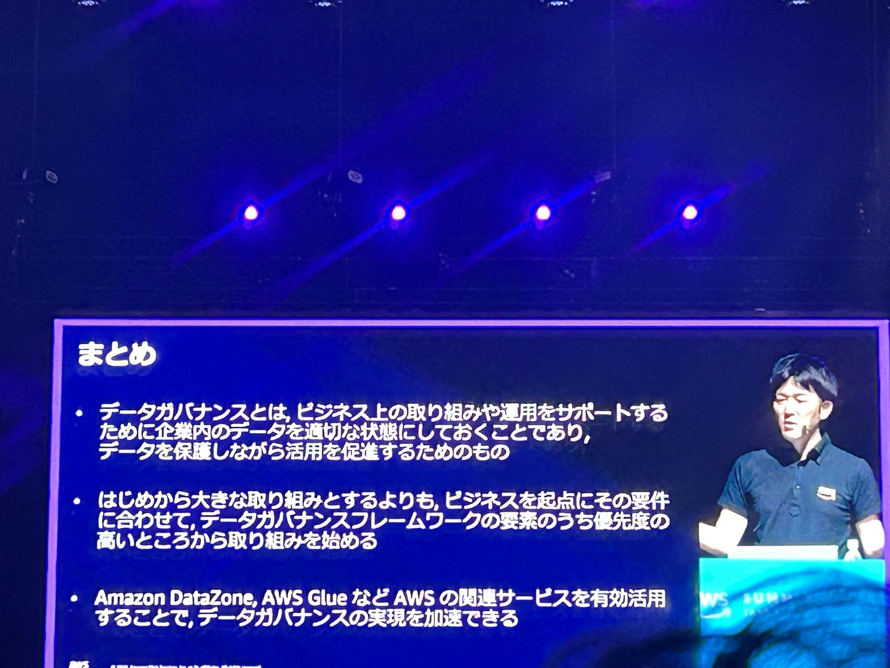

## AWSコスト管理の最前線

- CFM
- Cloud Financial Manager
- EC2 題材

- ぱぱっと確認したい時：CE(AWS Cost Explorer)
  - 請求書と同じ金額 → ブレンドコスト
  - Amazon Q(AI) に聞いても回答してくれる, リンク付き

### 可視化

- タグでリソースの管理者を識別できる
  - KV 式
  - 注意：コスト配分タグとして登録（有効化）しないとコスト関連サービスで見れない
    - org の時は Pay 権限を持つアカウントでないと利用できない
  - バックフィルで過去最大１２ヶ月遡って見る事ができる
- AWS Resource Explorer
  - 検索結果のエクスポートもできる
- 補足
  - AWS Tag Editor でタグのないリソースを検索
    - 一括タグづけが可能
  - AWS Config 高度なクエリ（まだ Preview 版）でも検索できる
  - AWS Service Catalog App Registry でもできる（裏技）

### 最適化

- AWS Cost And Usage Reports(CUR)
  - 請求と管理のデータエクスポートから作成
  - 格納先 S3 を指定
  - Amazon Athena（SQL）で分析可能
  - 最新＝ 2.0 を使おう
    - 今までのもの＝レガシー CUR
    - 改善済み
- AWS Cost And Usage Dashboard(CUD)

  - CUR 作成で S3 に格納から QuickSight の設定まで行う
  - いろんな分析ができる
  - 閲覧者にアクセス許可せずとも安全に共有できる

#### クイックウィン最適化

- 1. 需要に合うスケジューリング
  - EventBridge スケジューラと Lambda(シンプル)
  - Systems Manager, Resource Scheduler
    - マルチアカウントの場合
  - Instance Scheduler
- 2. 未使用リソース停止
- 3. インスタンスタイプの見直し
- 4. ストレージの見直し（EBS）
- 2-4 までリコメンデーション確認できる
  - AWS Cost Optimization Hub
- 5. Savings Plans
- 補足
  - Amazon CloudWatch natural language query generation
    - メトリクスで使える生成 AI→SQL

### 計画・予測

- AWS Budgets
  - 予算と予算アラートの設定（無料）
  - PJT 単位での指定も可能
- AWS Cost Anomaly Detection(無料)
  - 異常検知アラート
  - 利用状況を学習モデルによって学習 → ベースラインを超えた値を検知
  - CE を有効化すると自動で有効になる

## どこでもAI

### 歴史

- MMX：整数演算の高速化
- SSE：Streaming 拡張、浮動小数点演算の高速化
  - 音声認識とかでよく使う
  - 128bit→
- AVX：Advanced Vector Extension
- AMX：Advanced Matrix Extension
  - 行列演算
  - １次元のタイルアーキテクチャ → ２次元のタイルアーキテクチャ

### Xeon 第４世代について

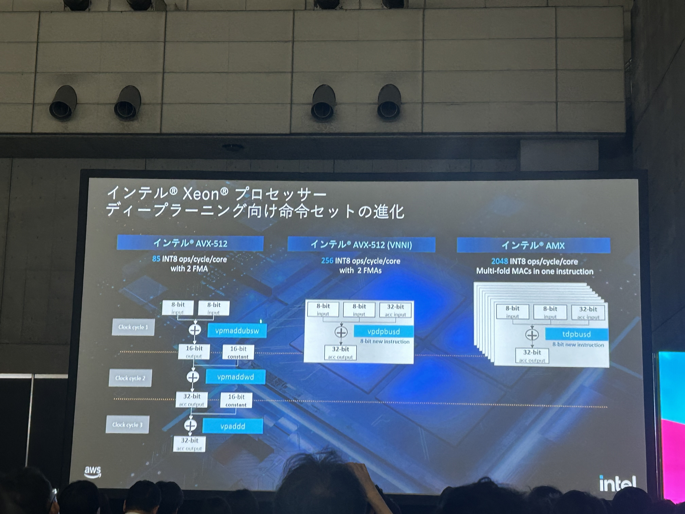

- intel Xeon（ジーオン）　クラウド用の GPU

  - 4chip が一つの基盤に実装されているイメージ
  - コヒーレンス
  - アクセラレータ
    - アプリケーション特化の計算をよくするユニット
    - c7i とかのインスタンスで利用でき、3 倍~10 倍性能が上がる
  - 省電力
  - AI 用に合わせて CPU、メモリも調整

- 命令セットの進化
  - AVX 1 クロックあたり、85 回整数演算可能
  - VNNI ３サイクルかかっていた処理を一つにまとめて 2.75 倍くらい速くなった
  - AMX 2048 INT8 ops/cycle/core、爆速！！！

AMX は FW 側で制御され、ユーザー側からはほぼ見えない

#### Performance

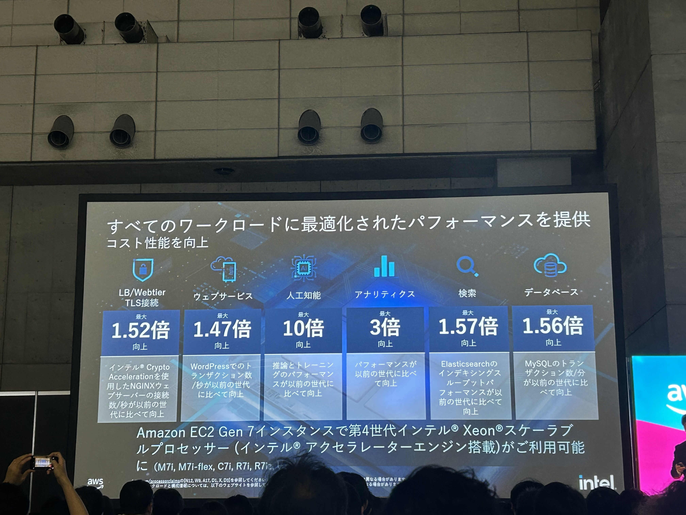

- Stable Diffusion
  - ファインチューニング：5 分以内
  - 生成：5 秒以内

CPU だけでもかなり速い

### Why Intel？

- 15 年以上、AWS とエンジニアリングパートナーシップ協定しているから

#### 実際の PJT 例

- がんの研究
- シドニー大学のゲノム研究　 10 日 →5 時間
- IoT, Edge

### ec2 instance

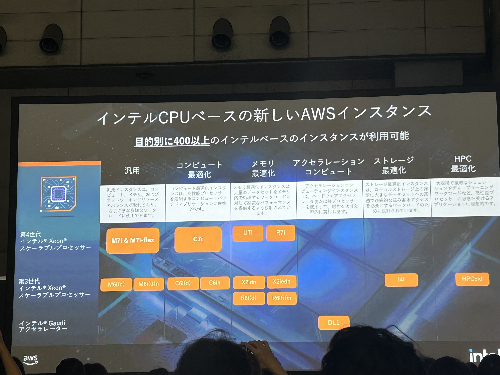

前世代と比較して、10 倍
M7i, C7i, R7i

### Intel でのユースケース

製造業が得意

- 機械の異常検知
- プロダクトの異常
- 機材に関するマニュアルを覚えた LLM の実証実験

#### model のソース

- Hugging Face 社と協力している
- Intel の専用ライブラリもあり、それでモデルの最適化、量子化、コンパクト化が可能

### 今後の AI

- パラメータの大きいモデル
- ドメインのエキスパート（計算量を小さくしたもの）

### エキスパートプロダクションモデル

- LLM-x（クローズド）
- LLM-Open(OSS)
- LLM-enterprise
- LLM-Expert
  - 7b~10b、鯖からスマホ
