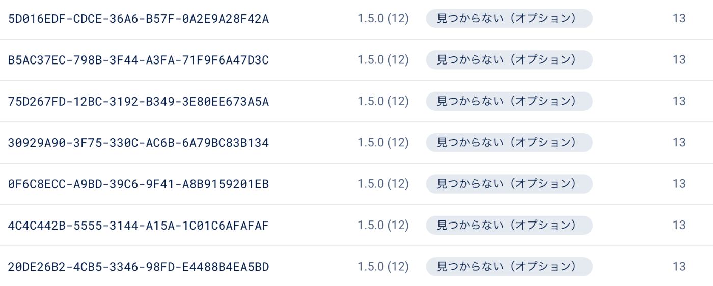
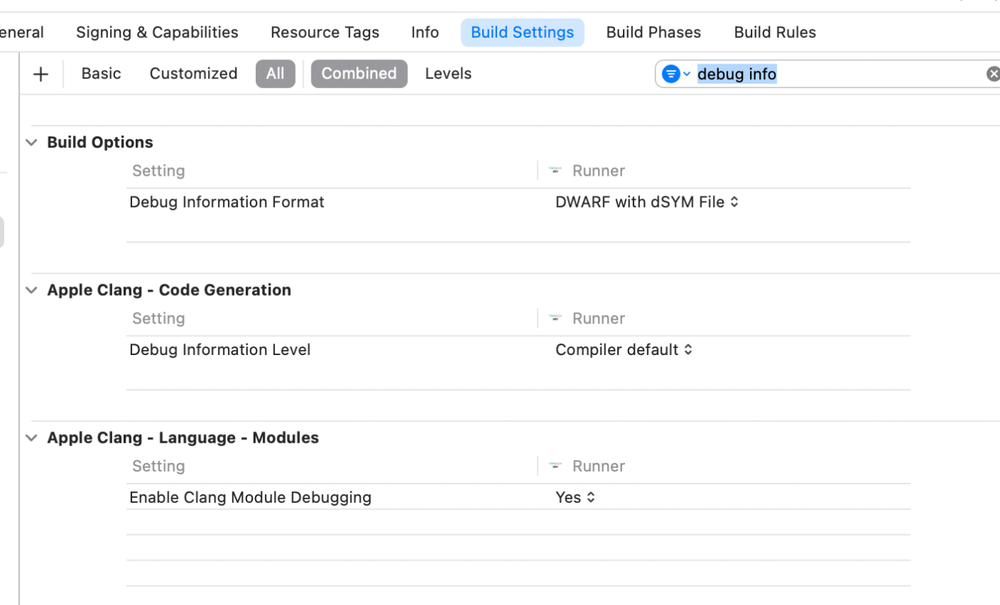
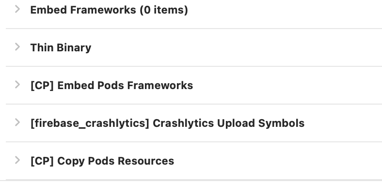
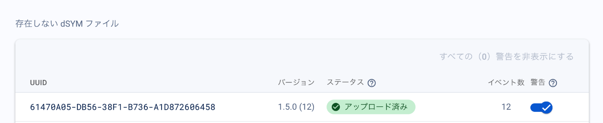

+++
date = '2024-02-29T20:46:00+09:00'
draft = false
title = 'Flutter Crashlytics導入ログ'
categories = ['tech']
tags = ["Flutter", "Firebase", 'memo']
+++

ガイドに従い、実行していく

https://firebase.google.com/docs/crashlytics/get-started?hl=ja&platform=flutter

テストクラッシュさせても何故かdSYMがないと言われる



TargetsのRunner > Build Settingsで`DWARF with dSYM File`にする



それでも変わらず、dSYMがないと言われたので、Run scriptからcrashlytics用のスクリプトを追加



以下のIssueコメント参考にスクリプトを変更
https://github.com/firebase/flutterfire/issues/10507#issuecomment-1447508272

```sh
#!/bin/bash
echo \"------${FLAVOR}------\"
# Run upload symbol script for appropriate target.
\"${PODS_ROOT}/FirebaseCrashlytics/upload-symbols\" -gsp \"${PROJECT_DIR}/${FLAVOR}/GoogleService-Info.plist\" -p ios \"${DWARF_DSYM_FOLDER_PATH}/${DWARF_DSYM_FILE_NAME}\"

```

Input filesは以下のURLにある通りに追加

https://firebase.google.com/docs/crashlytics/get-deobfuscated-reports?platform=flutter&hl=ja#run-script-does-not-exist

無事、追加された

