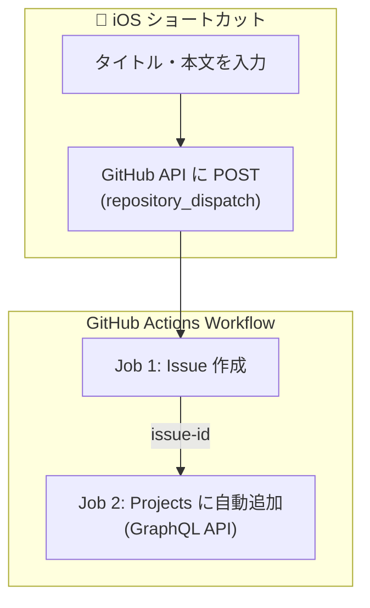

+++
date = '2026-02-14T18:00:01+09:00'
draft = false
title = 'GitHub Projectsでタスク管理してみる'
slug = 'github-projects-task-management'
categories = ['tech']
tags = ['GitHub Actions', 'GitHub Projects', 'iOS Shortcuts', 'Task Management']
+++

## はじめに

タスク管理を普段使うツール（GitHub）で実現してみたいと思い、作ってみました。
スマホから手軽に登録したかったので、iOSショートカットと組み合わせる仕組みをClaude Codeに作ってもらいました。

大部分はClaude Codeに作ってもらったのですが、今のところいい感じに運用できている気がするので、その辺をまとめます。

## 作ったもの（全体像）

最終的に作った仕組みの全体像はこんな感じです。



ポイントは、Issue作成とProjects追加をGitHub Actionsで一気通貫にしていることです。iOSショートカットからはAPI一発叩くだけで、Issue作成からProjects紐付けまで全部自動で完了します。

## 開発の流れ


```yaml
name: Create Issue and Add to Project

on:
  repository_dispatch:
    types: [create-issue]

permissions:
  issues: write
  contents: read

jobs:
  create-issue:
    runs-on: ubuntu-latest
    outputs:
      issue-number: ${{ steps.create-issue.outputs.issue-number }}
      issue-url: ${{ steps.create-issue.outputs.issue-url }}
      issue-id: ${{ steps.create-issue.outputs.issue-id }}
    steps:
      - name: Validate input
        env:
          ISSUE_TITLE: ${{ github.event.client_payload.title }}
        run: |
          if [ -z "$ISSUE_TITLE" ]; then
            echo "Error: title is required"
            exit 1
          fi

      - name: Create Issue
        id: create-issue
        uses: actions/github-script@v7
        env:
          ISSUE_TITLE: ${{ github.event.client_payload.title }}
          ISSUE_BODY: ${{ github.event.client_payload.body }}
        with:
          script: |
            const title = process.env.ISSUE_TITLE;
            const body = process.env.ISSUE_BODY || '';

            // Create the issue
            const issue = await github.rest.issues.create({
              owner: context.repo.owner,
              repo: context.repo.repo,
              title: title,
              body: body
            });

            console.log(`Created issue #${issue.data.number}: ${issue.data.html_url}`);
            core.setOutput('issue-number', issue.data.number);
            core.setOutput('issue-url', issue.data.html_url);
            core.setOutput('issue-id', issue.data.node_id);

            return issue.data;

      - name: Output Summary
        env:
          ISSUE_TITLE: ${{ github.event.client_payload.title }}
          ISSUE_NUMBER: ${{ steps.create-issue.outputs.issue-number }}
          ISSUE_URL: ${{ steps.create-issue.outputs.issue-url }}
        run: |
          echo "## Issue Created Successfully! 🎉" >> $GITHUB_STEP_SUMMARY
          echo "" >> $GITHUB_STEP_SUMMARY
          echo "**Issue #${ISSUE_NUMBER}**" >> $GITHUB_STEP_SUMMARY
          echo "" >> $GITHUB_STEP_SUMMARY
          echo "**Title:** ${ISSUE_TITLE}" >> $GITHUB_STEP_SUMMARY
          echo "" >> $GITHUB_STEP_SUMMARY
          echo "**URL:** ${ISSUE_URL}" >> $GITHUB_STEP_SUMMARY

  add-to-project:
    runs-on: ubuntu-latest
    needs: create-issue
    steps:
      - name: Add to GitHub Project
        uses: actions/github-script@v7
        env:
          PROJECT_ID: ${{ secrets.PROJECT_ID }}
          ISSUE_ID: ${{ needs.create-issue.outputs.issue-id }}
        with:
          github-token: ${{ secrets.PAT_TOKEN }}
          script: |
            const projectId = process.env.PROJECT_ID;
            const issueId = process.env.ISSUE_ID;

            try {
              const mutation = `
                mutation($projectId: ID!, $contentId: ID!) {
                  addProjectV2ItemById(input: {
                    projectId: $projectId
                    contentId: $contentId
                  }) {
                    item {
                      id
                    }
                  }
                }
              `;

              const result = await github.graphql(mutation, {
                projectId: projectId,
                contentId: issueId
              });

              console.log(`Added issue to project: ${JSON.stringify(result)}`);
            } catch (error) {
              console.error(`Failed to add issue to project: ${error.message}`);
              throw error
            }
```


### イメージと違ってRevert

最初にClaude Codeへお願いして出てきたワークフローが、私の想定とだいぶ違っていました。

- タイトル・本文に加えてラベルも外部から渡せる
- Project IDもリクエストのpayloadに含める仕様
- READMEも盛り盛りで、curlでのAPI実行例やパラメータ一覧表まで用意

汎用的に作ってくれたんだと思いますが、私がイメージしていたのはもっとシンプルなものでした。

結局一度全部Revertして、もう少し具体的にやりたいことを伝え直しました。

### 生成コードのレビューと改善

再スタート後はかなりシンプルになりました。ただ、生成されたコードをレビューしていくと、いくつか直したいポイントが出てきました。

#### テンプレートインジェクションの修正

生成されたワークフローでは、ユーザーからの入力（`client_payload`）をシェルコマンドに直接テンプレート展開していました。

```yaml
# 危険な例（修正前）
run: |
  echo "Title: ${{ github.event.client_payload.title }}"
```

これだとタイトルに悪意のある文字列を仕込むことで任意コード実行の可能性があります。いわゆるテンプレートインジェクションですね。環境変数を経由する形に修正しました。

```yaml
# 安全な例（修正後）
env:
  ISSUE_TITLE: ${{ github.event.client_payload.title }}
run: |
  echo "Title: $ISSUE_TITLE"
```


#### Projects連携の改善

Project IDをpayloadに含める仕様は、iOSショートカット側にハードコードが必要で微妙でした。リポジトリのSecretsに保存する方式に変更して、ショートカット側はタイトルと本文だけ送ればよい形にしました。

#### ジョブ分離

Issue作成とProjects追加を別ジョブに分離しました。

```yaml
jobs:
  create-issue:
    runs-on: ubuntu-latest
    outputs:
      issue-number: ${{ steps.create-issue.outputs.issue-number }}
      issue-url: ${{ steps.create-issue.outputs.issue-url }}
      issue-id: ${{ steps.create-issue.outputs.issue-id }}
    steps:
      # Issue作成処理...

  add-to-project:
    runs-on: ubuntu-latest
    needs: create-issue
    steps:
      # Projects追加処理...
```

「Issue作成は成功したけどProjects追加で失敗した」みたいな状況が切り分けやすくなりました。

あとはエラーハンドリングの調整もしています。当初はProjects追加のエラーを握りつぶしていたので、エラーをthrowしてワークフローを失敗させるように変更しました。

```javascript
} catch (error) {
  console.error(`Failed to add issue to project: ${error.message}`);
  throw error;  // エラーを投げてワークフローを失敗させる
}
```

### permissionsとPATの問題

いざ動かしてみると、いくつか問題がありました。

Claude Codeが生成したワークフローに`projects: write`というpermissionsが含まれていたのですが、実はこれGitHub Actionsの有効なスコープではありません。無効なスコープを書くとワークフロー自体がシンタックスエラーになります。削除して解決です。

もう一つ厄介だったのが、GITHUB_TOKEN vs PAT問題です。

GitHub Actionsでデフォルトで使える`GITHUB_TOKEN`は、そのリポジトリ内のリソースへのアクセスに限定されています。ところが、GitHub Projects V2のGraphQL APIはユーザーレベルのリソースとして扱われるため、`GITHUB_TOKEN`ではアクセスできません。

```yaml
# GITHUB_TOKENでは権限不足
github-token: ${{ secrets.GITHUB_TOKEN }}  # ← Projects APIにアクセスできない

# PATを使う
github-token: ${{ secrets.PAT_TOKEN }}  # ← これで解決
```


### iOSショートカットの設定

最終的なiOSショートカットの設定はシンプルです。

1. テキスト入力でタスクのタイトルを入力
2. URLの内容を取得でGitHub APIを叩く

```
URL: https://api.github.com/repos/{owner}/{repo}/dispatches
メソッド: POST
ヘッダー:
  Accept: application/vnd.github+json
  Authorization: Bearer {YOUR_PAT}
  X-GitHub-Api-Version: 2022-11-28
  Content-Type: application/json

ボディ:
{
  "event_type": "create-issue",
  "client_payload": {
    "title": "(入力したテキスト)",
    "body": ""
  }
}
```

これだけです。スマホからワンタップでIssue作成→Projects追加が完了します。
思いついた瞬間にタスク登録できるので、かなり快適です。

ただ、GitHub ActionsとiOSショートカットの両方でPATが必要になってしまう点はいずれ解消できればと思っています。

## まとめ

GitHub Projectsでタスク管理を始め、iOSショートカットと連携させることで
思いついた瞬間にスマホからとタスク登録できる仕組みが完成しました。

同じようにGitHubでタスク管理したいと考えている方の参考になれば幸いです。

## 参考文献

Appleのショートカット機能を使ってGitHubにIssueを追加する
https://zenn.dev/niyaton/articles/a6d007e046ad27

ワークフローをトリガーするイベント > repository_dispatch - GitHub
https://docs.github.com/ja/actions/reference/workflows-and-actions/events-that-trigger-workflows#repository_dispatch
