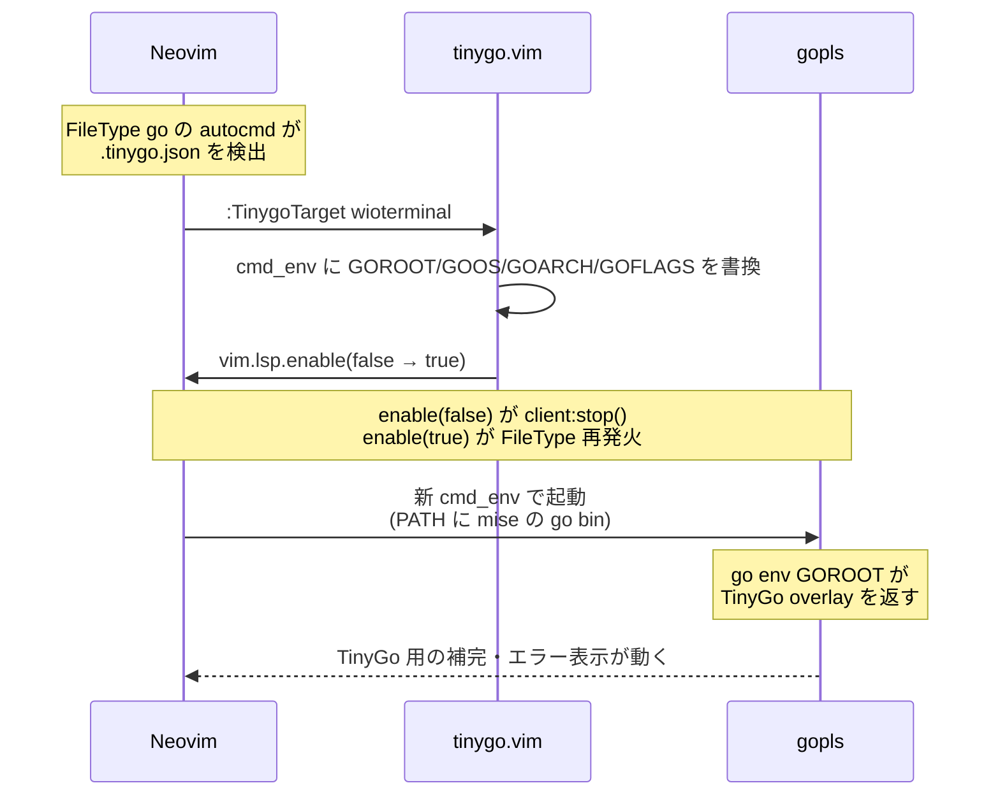

+++
date = '2026-07-06T13:00:00+09:00'
draft = true
title = 'Neovim で TinyGo (Wio Terminal) の補完を効かせる'
categories = ['tech']
tags = ['neovim', 'tinygo', 'go']
+++

## 概要

Wio Terminal 向けに TinyGo を書き始めたのですが、Neovim の gopls で `machine` パッケージが解決できず、
`.tinygo.json` を検出して target を切り替える構成を組んでも状況が変わりませんでした。
原因を追うと mise の shim が絡んでいたのでそれに対応し、あわせて target 切替の自動化も足した記録です。

### 手短なまとめ

- mise の `go` shim が env の GOROOT を尊重せず、gopls 内部の `go env` に TinyGo overlay の GOROOT が伝わらない → PATH に mise が使用する go 本体の bin を差し込んだ状態で gopls を起動する
- target の切り替えは `.tinygo.json` を開いた時点で自動的に走ってほしい → `FileType go` の autocmd で `:TinygoTarget` を呼ぶ

### 環境

- Neovim 0.12 系 (native LSP)
- Go / TinyGo は mise で管理
- `mise.toml`:

```toml
[tools]
go = "1.25"
tinygo = "0.41.1"
```

- ボード: Wio Terminal
- `main.go`:

```go
package main

import "machine"

func main() {
	led := machine.LED
	_ = led
}
```

- `.tinygo.json`:

```json
{"target": "wioterminal"}
```

## 起きていたこと

Neovim で `main.go` を開くと、gopls が以下のエラーを出していました。

```
could not import machine (no required module provides package "machine")
```

当然 `machine.LED` の補完も効きません。組み込みを書くのに `machine.` の先が見えないと不便なので、
これをなんとかするというのが出発点です。

## 対応したこと

1. shim を経由せずに gopls を起動する
2. `.tinygo.json` を開いた時点で `:TinygoTarget` を自動で走らせる

### shim を経由せずに gopls を起動する

`.tinygo.json` から target を切り替えると、gopls プロセスの env には正しい TinyGo overlay の GOROOT
(`~/Library/Caches/tinygo/goroot-<hash>`) が入っていました。にもかかわらず、
gopls 内部で `go env` を呼ぶと **通常の Go の GOROOT** が返ってきます。

原因は mise の shim (`~/.local/share/mise/shims/go`) で、env の GOROOT を尊重せず、mise 側で管理している値で
上書きしていました。gopls は `go env GOROOT` を呼んでモジュール解決するので、
親プロセスから渡した GOROOT は shim の内側でリセットされてしまいます。

shim を経由しない go bin を PATH 先頭に置いてから gopls を起動する形にしました。
`mise which go` は mise が使用する go のパスを返してくれるので、そこから bin ディレクトリを求めて差し込みます。

```lua
local go_dir = vim.fs.dirname(vim.trim(vim.fn.system('mise which go')))
M.cmd = { 'env', 'PATH=' .. go_dir .. ':' .. vim.env.PATH, 'gopls' }
```

これで gopls 内部の `go env` が TinyGo overlay の GOROOT を素直に返すようになります。

### `.tinygo.json` を開いた時点で `:TinygoTarget` を自動で走らせる

target 切替は `sago35/tinygo.vim` が提供する `:TinygoTarget <target>` で行いますが、
これを明示的に呼ばないと反映されないので、プロジェクトを開くたびに実行する形になります。
target は `.tinygo.json` に書いてあるので、これを開いた時点で自動的に反映されてほしいところです。

`FileType go` のタイミングで上向きに `.tinygo.json` を探し、あれば `:TinygoTarget` を呼ぶ autocmd を足しました。
`:TinygoTarget` は毎回呼ぶと gopls を再起動して重いので、同じディレクトリ・同じ target なら
1 セッションで 1 回だけ実行されるようガードを入れています。

```lua
local applied = {}
vim.api.nvim_create_autocmd('FileType', {
  pattern = 'go',
  group = vim.api.nvim_create_augroup('tinygo-auto', {}),
  callback = function(args)
    local root = vim.fs.root(args.buf, '.tinygo.json')
    if not root then return end
    local ok, cfg = pcall(vim.json.decode,
      table.concat(vim.fn.readfile(vim.fs.joinpath(root, '.tinygo.json')), '\n'))
    if not ok or type(cfg) ~= 'table' or not cfg.target then return end
    if applied[root] == cfg.target then return end
    applied[root] = cfg.target
    vim.cmd({ cmd = 'TinygoTarget', args = { cfg.target } })
  end,
})
```

## 全体のフロー

`.tinygo.json` を持つプロジェクトを開いた時の挙動は最終的にこうなります。



## 終わりに

補完が効くようになってからは、Wio Terminal 向けの TinyGo コードを快適に書けるようになりました。
Lチカという次のステップに気持ちよく進めます。

読んでいただき、ありがとうございました！

## 参考

- `sago35/tinygo.vim`: https://github.com/sago35/tinygo.vim
