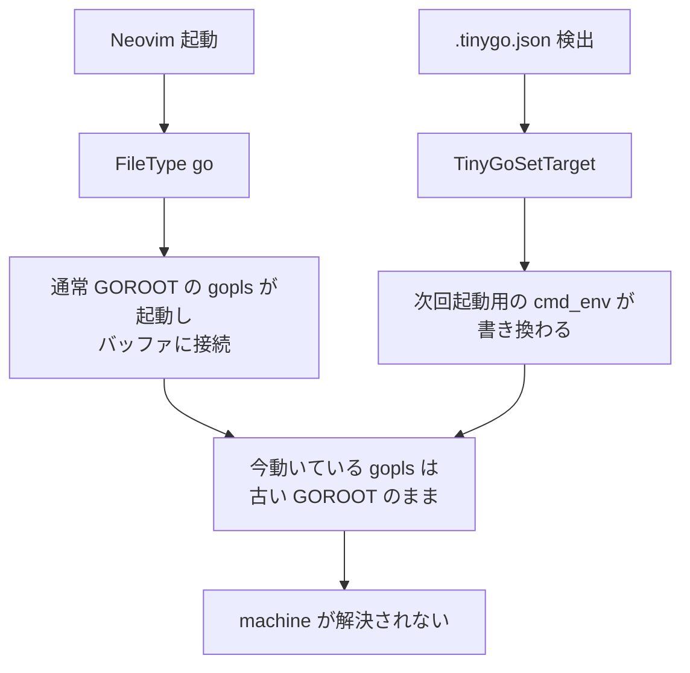

+++
date = '2026-07-06T13:00:00+09:00'
draft = true
title = 'tinygo.nvim から tinygo.vim に乗り換えた'
categories = ['tech']
tags = ['neovim', 'tinygo', 'go']
+++

## 概要

Wio Terminal 向けに TinyGo を書き始めたのですが、Neovim 上で gopls が `machine` パッケージを解決してくれず、
補完もエラー表示も TinyGo 用の内容にならない状態でした。

`.tinygo.json` を検出して `pcolladosoto/tinygo.nvim` で target を切り替える構成にしていたのですが、
それでも補完が復活しません。原因を追ってみたところ 2 つの要因が絡んでいたので、
プラグインを `sago35/tinygo.vim` に乗り換えつつ、mise 側の挙動も回避する形で整理しました。

### 手短なまとめ

- Neovim 0.11 の native LSP における `vim.lsp.enable(name, false)` は、attach 済みクライアントを止めてくれない
- mise の `go` shim は env の GOROOT を尊重しないので、gopls 内部の `go env` に TinyGo overlay の GOROOT が伝わらない
- 上記 2 点は `sago35/tinygo.vim` と、gopls コマンドを `env PATH=<mise-go-dir>:...` でラップする対応で解消できた

## 環境

- Neovim 0.11 系（native LSP）
- Go / TinyGo は mise で管理
- `mise.toml`:

```toml
[tools]
go = "1.25"
tinygo = "latest"
```

- ボード: Wio Terminal
- `main.go`:

```go
package main

import "machine"

func main() {
	led := machine.LED
	_ = led
}
```

- `.tinygo.json`:

```json
{"target": "wioterminal"}
```

## 起きていたこと

Neovim で `main.go` を開くと、gopls が以下のエラーを出していました。

```
could not import machine (no required module provides package "machine")
```

当然 `machine.LED` の補完も効きません。組み込みを書くのに `machine.` の先が見えないと辛いので、
なんとかしたいというのが出発点です。

## 原因1: `vim.lsp.enable(name, false)` は起動中の gopls を終了しない

はじめは `pcolladosoto/tinygo.nvim` を使っていて、`.tinygo.json` を見つけて `TinyGoSetTarget <target>` を叩く導線を組んでいました。
プラグイン本体の `applyConfigFile` は相対パスで `.tinygo.json` を探すので、
nvim の cwd がプロジェクト外だと拾えません。そこは bufname から上向き探索する版に差し替えて使っていました。

これで target 切替までは走るのですが、それでも補完は戻ってきません。中で何をしているか確認すると、こういう流れでした。

```lua
vim.lsp.config('gopls', { cmd_env = { GOROOT = ..., GOFLAGS = ... } })
vim.lsp.enable('gopls', false)
vim.lsp.enable('gopls', true)
```

Neovim 0.11 の native LSP では、`vim.lsp.enable(name, false)` は **今後 gopls を起動する仕組み (FileType autocmd) を外すだけ** で、
すでに起動してバッファに繋がっている gopls プロセスは終了させてくれません。
つまり順を追うとこうなります。



`vim.lsp.get_clients({ name = 'gopls' })` から `client:stop(true)` を叩き、
その後 FileType を再発火させれば直りますが、
プラグインを monkey-patch し続けるのはプラグイン本体が更新されると壊れやすく、避けたい形です。

## 原因2: mise の `go` shim が GOROOT env を尊重しない

target 切替後、GOROOT が gopls に届いているかを確認したところ、
gopls プロセスの env には正しい TinyGo overlay の GOROOT (`~/Library/Caches/tinygo/goroot-<hash>`) が入っていました。
にもかかわらず、gopls 内部から `go env` を叩くと **素の Go の GOROOT** が返ってきます。

追ってみると、mise の shim (`~/.local/share/mise/shims/go`) が env の GOROOT を尊重せず、
mise 側で管理している GOROOT で上書きしていました。
gopls は内部で `go env GOROOT` を呼んでモジュール解決するので、
親プロセスから GOROOT を渡しても shim の内側でリセットされてしまいます。

回避策として、gopls 起動時に shim を経由しない go bin を PATH 先頭に置きます。
`mise which go` で shim を介さない実体のパスが取れるので、そこから bin ディレクトリを求めて差し込みました。

```lua
local go_dir = vim.fs.dirname(vim.trim(vim.fn.system('mise which go')))
M.cmd = { 'env', 'PATH=' .. go_dir .. ':' .. vim.env.PATH, 'gopls' }
```

これで gopls 内部の `go env` が TinyGo overlay の GOROOT を素直に返すようになりました。

## なぜ乗り換えたのか

原因1 は `pcolladosoto/tinygo.nvim` を monkey-patch し続ける手でも対応できて、実際に
`applyConfigFile` の相対パス問題と、`setTarget` の LSP 再起動が中途半端な件の両方を
プラグイン内部を書き換えることで一度は動く状態にできていました。

とはいえ、どちらもプラグイン内部実装への手出しなので、プラグイン本体が更新されると壊れやすい形です。
書くコード量としては乗り換え後もラッパーと自動検出 autocmd で似たような分量になるのですが、
`sago35/tinygo.vim` を使う場合は `:TinygoTarget` という公開コマンドの上に薄く乗せているだけで、
プラグイン内部には一切触っていません。動くかどうかだけでなく、後から自分で読み返したときにも
意味が追いやすいのは公開 API に乗せた方だと判断して、乗り換えました。

補足として、`sago35/tinygo.vim` には以下の利点もあります。

- `:TinygoTarget <target>` で GOROOT / GOOS / GOARCH / GOFLAGS を LSP config に流し込んでくれる
- 起動中の gopls をきちんと終了させてくれる
- `tinygo#TinygoTargets` でターゲット補完も提供してくれる

## 対応: `sago35/tinygo.vim` に乗り換える

Neovim 0.11 の native LSP 側で「stop 後の再 attach」を叩いてくれないケースがあるので、
そこは `:Tinygo` というラッパーを用意し、FileType の再発火で拾わせるようにしました。

```lua
vim.pack.add({ 'https://github.com/sago35/tinygo.vim' })

vim.api.nvim_create_user_command('Tinygo', function(opts)
  vim.cmd.TinygoTarget(opts.args)
  local buf = vim.api.nvim_get_current_buf()
  vim.schedule(function()
    vim.api.nvim_exec_autocmds('FileType', { buffer = buf })
  end)
end, {
  nargs = 1,
  complete = function(arglead) return vim.fn['tinygo#TinygoTargets'](arglead, '', 0) end,
})
```

FileType を再発火させれば `vim.lsp.enable('gopls', true)` 側の autocmd が拾って、
新しい設定で gopls を attach し直してくれます。

## `.tinygo.json` を開いた時点で切り替わるようにする

`sago35/tinygo.vim` は `:Tinygo <target>` で明示的にターゲットを切り替える形なので、
プロジェクトを開いた時点で自動的に切り替わってほしい部分だけ薄く autocmd を足しました。
`FileType go` のタイミングで上向きに `.tinygo.json` を探し、あれば `:Tinygo <target>` を呼びます。
同じファイル・同じ target なら 1 セッションで 1 回だけ実行されるようガードも入れています。

```lua
local tinygo_applied = {}
vim.api.nvim_create_autocmd('FileType', {
  pattern = 'go',
  group = vim.api.nvim_create_augroup('tinygo-auto', {}),
  callback = function(args)
    local search = vim.fs.dirname(vim.api.nvim_buf_get_name(args.buf))
    local found = vim.fs.find({ '.tinygo.json' }, { upward = true, path = search })
    if vim.tbl_isempty(found) then return end
    local f = io.open(found[1], 'r')
    if not f then return end
    local raw = f:read('a')
    f:close()
    local ok, cfg = pcall(vim.json.decode, raw)
    if not ok or type(cfg) ~= 'table' or cfg.target == nil then return end
    if tinygo_applied[found[1]] == cfg.target then return end
    tinygo_applied[found[1]] = cfg.target
    vim.cmd({ cmd = 'Tinygo', args = { cfg.target } })
  end,
})
```

## 終わりに

補完が戻ってきてからは、Wio Terminal 向けの TinyGo コードを書くのがだいぶ楽になりました。
mise + TinyGo + Neovim の組み合わせで `machine` が解決できないケースは、
だいたい今回の 2 つの要因のどちらか（あるいは両方）にはまっている気がします。
同じような状況で困っている方の参考になれば嬉しいです。

読んでいただき、ありがとうございました！

## 参考

- `sago35/tinygo.vim`: https://github.com/sago35/tinygo.vim
- `pcolladosoto/tinygo.nvim`: https://github.com/pcolladosoto/tinygo.nvim
