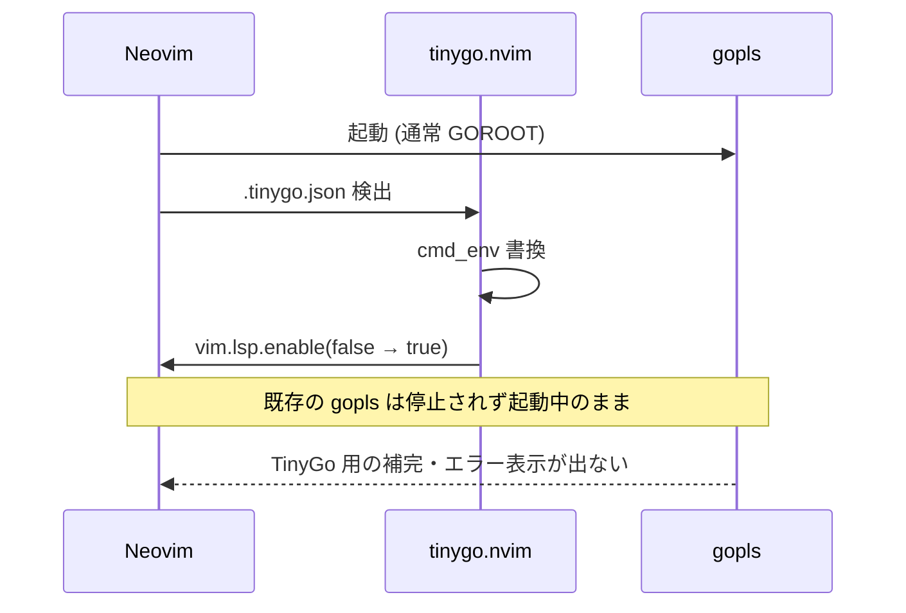

+++
date = '2026-07-06T13:00:00+09:00'
draft = true
title = 'tinygo.nvim から tinygo.vim に乗り換えた'
categories = ['tech']
tags = ['neovim', 'tinygo', 'go']
+++

## 概要

Wio Terminal 向けに TinyGo を書き始めたのですが、Neovim 上で gopls が `machine` パッケージを解決してくれず、
補完もエラー表示も TinyGo 用の内容にならない状態でした。

`.tinygo.json` を検出して `pcolladosoto/tinygo.nvim` で target を切り替える構成にしていたのですが、
それでも補完が復活しません。原因を追ってみたところ 2 つの要因が絡んでいたので、
プラグインを `sago35/tinygo.vim` に乗り換えつつ、mise 側の挙動も回避する形で整理しました。

### 手短なまとめ

- Neovim 0.11 系 (0.11.2 未満) の native LSP では、`vim.lsp.enable(name, false)` を呼んでも起動中の gopls を停止しない
- mise の `go` shim は env の GOROOT を尊重しないので、gopls 内部の `go env` に TinyGo overlay の GOROOT が伝わらない
- 上記 2 点を `sago35/tinygo.vim` + `:Tinygo` ラッパーと、gopls コマンドを `env PATH=<mise-go-dir>:...` でラップする対応で解消しています

### 環境

- Neovim 0.11 系 (0.11.2 未満、native LSP)
- Go / TinyGo は mise で管理
- `mise.toml`:

```toml
[tools]
go = "1.25"
tinygo = "0.41.1"
```

- ボード: Wio Terminal
- `main.go`:

```go
package main

import "machine"

func main() {
	led := machine.LED
	_ = led
}
```

- `.tinygo.json`:

```json
{"target": "wioterminal"}
```

## 起きていたこと

Neovim で `main.go` を開くと、gopls が以下のエラーを出していました。

```
could not import machine (no required module provides package "machine")
```

当然 `machine.LED` の補完も効きません。組み込みを書くのに `machine.` の先が見えないと不便なので、
これをなんとかするというのが出発点です。

## gopls の再起動が target 切替に追従しない

### 課題: `vim.lsp.enable(name, false)` は起動中の gopls を停止しない

はじめは `pcolladosoto/tinygo.nvim` を使っていて、`.tinygo.json` を見つけて `TinyGoSetTarget <target>` を呼ぶ仕組みにしていました。
プラグイン本体の `applyConfigFile` は相対パスで `.tinygo.json` を探すので、
nvim の cwd がプロジェクト外だと拾えません。そこは bufname から上向き探索する版に差し替えて使っていました。

これで target 切替までは走るのですが、それでも補完は戻ってきません。中で何をしているか確認すると、こういう流れでした。

```lua
vim.lsp.config('gopls', { cmd_env = { GOROOT = ..., GOFLAGS = ... } })
vim.lsp.enable('gopls', false)
vim.lsp.enable('gopls', true)
```

当時使っていた Neovim 0.11 系 (0.11.2 未満) の native LSP では、
`vim.lsp.enable(name, false)` は **今後 gopls を起動する仕組み (FileType autocmd) を外すだけ** で、
すでに起動してバッファに繋がっている gopls プロセスは停止させてくれません
（この点は 0.11.2 で挙動が改善されているようです）。
つまり順を追うとこうなります。



`vim.lsp.get_clients({ name = 'gopls' })` から `client:stop(true)` を呼び、
その後 FileType を再発火させれば直りますが、
プラグイン内部を書き換え続けるのはプラグイン本体が更新されると壊れやすい形です。

### 対応: `sago35/tinygo.vim` に乗り換える

公開コマンドの上に薄く自前コードを乗せる形にしたく、`sago35/tinygo.vim` に乗り換えました。
提供されるのは以下です。

- `:TinygoTarget <target>` で GOROOT / GOOS / GOARCH / GOFLAGS を LSP config に流し込んでくれる
- `tinygo#TinygoTargets` で target 補完も提供してくれる

target 切替後の再 attach は `:TinygoTarget` 単体では拾えないケースがあるので、
`:Tinygo` というラッパーを用意し、`:TinygoTarget` の後で FileType を再発火して gopls を上げ直させます。

```lua
vim.pack.add({ 'https://github.com/sago35/tinygo.vim' })

vim.api.nvim_create_user_command('Tinygo', function(opts)
  vim.cmd.TinygoTarget(opts.args)
  local buf = vim.api.nvim_get_current_buf()
  vim.schedule(function()
    vim.api.nvim_exec_autocmds('FileType', { buffer = buf })
  end)
end, {
  nargs = 1,
  complete = function(arglead) return vim.fn['tinygo#TinygoTargets'](arglead, '', 0) end,
})
```

FileType を再発火させれば `vim.lsp.enable('gopls', true)` 側の autocmd が拾って、
新しい設定で gopls を attach し直してくれます。

## mise の `go` shim が GOROOT env を上書きする

### 課題: gopls 内部の `go env` に TinyGo overlay の GOROOT が伝わらない

target 切替後、GOROOT が gopls に届いているかを確認したところ、
gopls プロセスの env には正しい TinyGo overlay の GOROOT (`~/Library/Caches/tinygo/goroot-<hash>`) が入っていました。
にもかかわらず、gopls 内部から `go env` を実行すると **通常の Go の GOROOT** が返ってきます。

追ってみると、mise の shim (`~/.local/share/mise/shims/go`) が env の GOROOT を尊重せず、
mise 側で管理している GOROOT で上書きしていました。
gopls は内部で `go env GOROOT` を呼んでモジュール解決するので、
親プロセスから GOROOT を渡しても shim の内側でリセットされてしまいます。

### 対応: shim を経由せずに gopls を起動する

shim を経由しない go bin を PATH 先頭に置いてから gopls を起動します。
`mise which go` は mise が使用する go のパスを返してくれるので、そこから bin ディレクトリを求めて差し込みました。

```lua
local go_dir = vim.fs.dirname(vim.trim(vim.fn.system('mise which go')))
M.cmd = { 'env', 'PATH=' .. go_dir .. ':' .. vim.env.PATH, 'gopls' }
```

これで gopls 内部の `go env` が TinyGo overlay の GOROOT を素直に返すようになりました。

## `.tinygo.json` の target が自動反映されない

### 課題: プロジェクトを開くたびに `:Tinygo <target>` を呼ぶ必要がある

`sago35/tinygo.vim` は `:Tinygo <target>` で明示的に target を切り替える形なので、
プロジェクトを開くたびに実行が必要になります。TinyGo プロジェクトごとに target は `.tinygo.json` で決まっているので、
これを開いた時点で自動的に反映されてほしいところです。

### 対応: `FileType go` の autocmd で自動反映する

`FileType go` のタイミングで上向きに `.tinygo.json` を探し、あれば `:Tinygo <target>` を呼ぶ autocmd を足しました。
同じファイル・同じ target なら 1 セッションで 1 回だけ実行されるようガードも入れています。

```lua
local tinygo_applied = {}
vim.api.nvim_create_autocmd('FileType', {
  pattern = 'go',
  group = vim.api.nvim_create_augroup('tinygo-auto', {}),
  callback = function(args)
    local search = vim.fs.dirname(vim.api.nvim_buf_get_name(args.buf))
    local found = vim.fs.find({ '.tinygo.json' }, { upward = true, path = search })
    if vim.tbl_isempty(found) then return end
    local f = io.open(found[1], 'r')
    if not f then return end
    local raw = f:read('a')
    f:close()
    local ok, cfg = pcall(vim.json.decode, raw)
    if not ok or type(cfg) ~= 'table' or cfg.target == nil then return end
    if tinygo_applied[found[1]] == cfg.target then return end
    tinygo_applied[found[1]] = cfg.target
    vim.cmd({ cmd = 'Tinygo', args = { cfg.target } })
  end,
})
```

## 対応後のフロー

3 点を合わせると、`.tinygo.json` を持つプロジェクトを開いた時の挙動はこうなります。

```mermaid
sequenceDiagram
    participant Nvim as Neovim
    participant Wrap as :Tinygo ラッパー
    participant Plugin as tinygo.vim
    participant Gopls as gopls
    Nvim->>Wrap: .tinygo.json 検出 → :Tinygo &lt;target&gt;
    Wrap->>Plugin: :TinygoTarget &lt;target&gt;
    Plugin->>Plugin: cmd_env 書換 + vim.lsp.enable(false → true)
    Wrap->>Nvim: FileType 再発火
    Nvim->>Gopls: 新 cmd_env で起動<br/>(PATH に mise の go bin)
    Note over Gopls: go env GOROOT が<br/>TinyGo overlay を返す
    Gopls-->>Nvim: TinyGo 用の補完・エラー表示が動く
```

## 終わりに

補完が戻ってきてからは、Wio Terminal 向けの TinyGo コードを快適に書けるようになりました。
mise + TinyGo + Neovim の組み合わせで `machine` が解決できない場合、
今回の 2 つの要因のどちらか (あるいは両方) に該当することが多いようです。
同じような状況で困っている方の参考になれば嬉しいです。

読んでいただき、ありがとうございました！

## 参考

- `sago35/tinygo.vim`: https://github.com/sago35/tinygo.vim
- `pcolladosoto/tinygo.nvim`: https://github.com/pcolladosoto/tinygo.nvim
