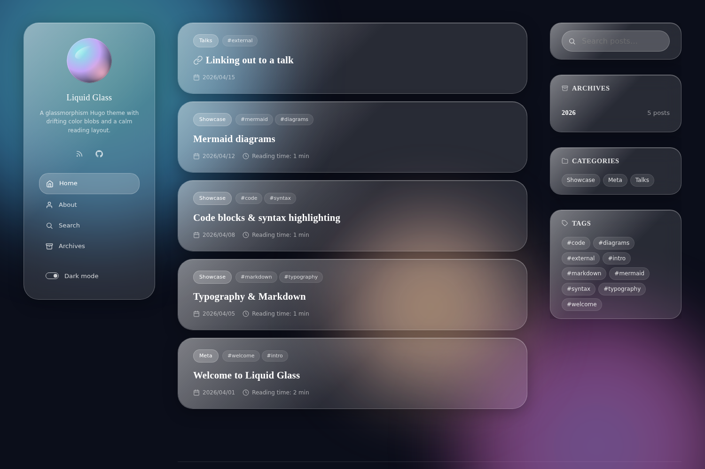

# Stack Liquid Glass

A glassmorphism Hugo theme. Stack-inspired layout, three drifting color blobs in the background, real `backdrop-filter` translucency, light/dark mode with localStorage persistence, zero JS dependencies.



## Features

- **Real glass surfaces** — `backdrop-filter` with reflection layers, not flat tinted boxes
- **Animated scene** — three CSS-only color blobs drift behind every page
- **Dark + light** — `data-theme` attribute, localStorage persisted, prefers-color-scheme aware
- **Zero JS deps** — ~5 KB vanilla JS for theme toggle, ripple, mobile nav, code copy
- **Standard Hugo features** — search (client-side), TOC, related posts, mermaid (lazy-loaded), syntax highlighting, RSS, OpenGraph + Twitter Card
- **i18n-ready** — English (`i18n/en.toml`) and Japanese (`i18n/ja.toml`) ship; add other locales by dropping in `<lang>.toml`
- **External-URL posts** — front-matter `externalUrl` turns a card into a direct out-link
- **Responsive** — single-column on mobile, sidebar+content+widget grid on desktop

## Requirements

- Hugo **0.146.0** or newer (extended is fine but not required)

## Install

### As a git submodule

```bash
git submodule add https://github.com/rin2yh/stack-liquid-glass.git themes/stack-liquid-glass
```

Then in your `hugo.toml`:

```toml
theme = "stack-liquid-glass"
```

### As a Hugo Module

```bash
hugo mod init github.com/you/your-blog
hugo mod get github.com/rin2yh/stack-liquid-glass
```

Then in your `hugo.toml`:

```toml
[module]
  [[module.imports]]
    path = "github.com/rin2yh/stack-liquid-glass"
```

### Manual

Download the latest release and unpack into `themes/stack-liquid-glass/`.

## Try the example

```bash
cd themes/stack-liquid-glass/exampleSite
hugo serve --themesDir ../..
```

Then open http://localhost:1313/.

## Configuration

The minimum config:

```toml
theme = "stack-liquid-glass"

[params]
description = "Your tagline shows up under the avatar in the sidebar."
mainSections = ["post"]

  [params.sidebar.avatar]
  enabled = true
  local = true
  src = "image/avatar.svg"  # any file in your site's assets/ — png, webp, or svg

  [[params.widgets.homepage]]
  type = "search"
  [[params.widgets.homepage]]
  type = "archives"
    [params.widgets.homepage.params]
    limit = 10
  [[params.widgets.homepage]]
  type = "categories"
  [[params.widgets.homepage]]
  type = "tag-cloud"

  [[params.widgets.page]]
  type = "toc"
```

See [`exampleSite/hugo.toml`](exampleSite/hugo.toml) for the full surface, including footer, dateFormat, opengraph, defaultImage, and related-content settings.

### Available widgets

| `type` | Where it shows | Notes |
|---|---|---|
| `search` | homepage | Renders the search input; results are live and client-side |
| `archives` | homepage | Year-grouped post list, capped by `limit` |
| `categories` | homepage | Top-N categories by post count |
| `tag-cloud` | homepage | Tag chips, capped by `limit` |
| `toc` | single pages | Auto-built from headings, scroll-spy highlights |
| `twitter-share` | single pages | Single share button |

### Menu icons

Available `[menu.main.params.icon]` values — see [`assets/icons/`](assets/icons/) for the full set. Common ones: `home`, `user`, `search`, `archives`, `rss`, `brand-github`, `brand-twitter`, `clock`, `date`.

### External-URL posts

```toml
+++
title = "Linking out to a talk"
date = 2026-04-15
externalUrl = "https://example.com/your-talk"
readingTime = false
+++
```

The article card becomes a direct link to `externalUrl`; no individual page is generated.

## Customizing

Design decisions live as CSS custom properties in [`assets/css/partials/_tokens.css`](assets/css/partials/_tokens.css). To override, drop a small CSS file into your **site's** `assets/css/` and append it to the bundle in `head/head.html` — or simpler, override the variables in a `<style>` tag inside a custom `head-end` partial:

```css
:root {
  --accent-aqua: #34d399;
  --accent-violet: #818cf8;
  --color-bg: #0a0a0f;
}
```

Common knobs:

- `--blur-md` — glass blur strength (default `18px`)
- `--glass-white` / `--glass-dark` — surface tint
- `--accent-aqua` / `--accent-violet` / `--accent-rose` — link, focus ring, and blob colors
- `--font-display` / `--font-ui` / `--font-body` — font stack

## Browser support

`backdrop-filter` is the load-bearing CSS feature. Supported on all current evergreen browsers including Safari (with `-webkit-` prefix, included). Older Firefox versions degrade to a slightly more opaque background — still readable, just less translucent.

## Credits

This theme draws heavily from two prior works. Big thanks to both:

- **[Hugo Theme Stack](https://github.com/CaiJimmy/hugo-theme-stack)** ([demo](https://stack.jimmycai.com/)) by Jimmy Cai — the layout architecture (sidebar profile + content + widget grid, archive / search / related-posts patterns, partial structure) is a direct homage. No Stack source files are vendored; every template and stylesheet is written from scratch.
- **[Liquid Glass UI Kit](https://codepen.io/Margarita-the-solid/pen/NPRPBjd)** by Margarita — the visual language (translucent surfaces, drifting color blobs behind the content, reflection highlights on glass cards) was adapted from this CodePen.

## License

MIT — see [LICENSE](LICENSE).
